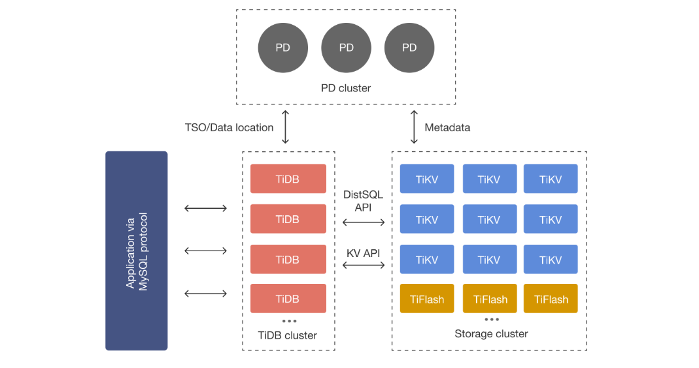

  <h1 align="center">TiDB 分布式NewSQL数据库</h1>
  

    <a href="README.md"><strong>English</strong></a> | <strong>简体中文</strong>
  

## 目录

- [仓库简介](#项目介绍)
- [前置条件](#前置条件)
- [镜像说明](#镜像说明)
- [获取帮助](#获取帮助)
- [如何贡献](#如何贡献)

## 项目介绍
‌[TiDB‌](https://github.com/pingcap/tidb) TiDB 是一款开源的 分布式 NewSQL 数据库，由 PingCAP 公司开发，并成为 CNCF（Cloud Native Computing Foundation） 的毕业项目（与 Kubernetes、Prometheus 同级）。它结合了 传统关系型数据库（如 MySQL）的易用性 和 NoSQL 数据库的可扩展性，适用于 高并发、海量数据的在线事务处理（OLTP）和在线分析处理（OLAP） 场景。

**核心特性：**
1. 分布式架构：TiDB采用计算-存储分离的分布式架构，计算层（TiDB Server）负责SQL解析与执行，存储层（TiKV）基于Raft协议实现数据高可用，调度层（PD）负责全局元数据管理与负载均衡。支持水平扩展，可处理PB级数据与百万级QPS。
2. MySQL高度兼容：兼容MySQL 5.7协议及常用语法（如JOIN、事务、窗口函数），支持主流ORM框架和MySQL生态工具（如mysqldump、Navicat）。应用无需改造即可迁移，降低业务切换成本。
3. 弹性水平扩展：通过动态添加TiKV或TiDB节点实现存储或计算能力线性扩展，扩展过程对业务透明。支持自动分片（Region）与负载均衡，避免热点问题，适合增长快速的业务场景。
4. 强一致性事务：基于Percolator模型实现分布式ACID事务，支持乐观锁与悲观锁模式，提供快照隔离（SI）和读已提交（RC）隔离级别。通过两阶段提交（2PC）保证跨节点事务一致性。
5. 实时HTAP能力：通过行列混合存储引擎TiFlash实现实时分析处理（OLAP），支持TiKV（行存）与TiFlash（列存）协同计算，同一份数据同时服务TP（事务处理）和AP（分析）场景，避免ETL延迟。
6. 高可用与自动恢复：数据以Region为单位多副本（默认3副本）存储，基于Raft协议实现故障自动切换，单节点故障不影响数据可用性。PD支持Leader选举，集群管理组件无单点故障。
7. 云原生设计：支持Kubernetes部署（TiDB Operator），提供自动化运维能力（扩缩容、升级、备份）。存储层支持本地SSD或云盘，与AWS、GCP等云平台深度集成，适合混合云场景。
8. 企业级监控与诊断：内置Prometheus+Grafana监控体系，提供集群健康、性能指标（如延迟、QPS）可视化。集成TiDB Dashboard，支持SQL性能分析、慢查询诊断与实时拓扑查看。
9. 多租户与资源隔离：通过Resource Control特性实现CPU、I/O等资源隔离，支持按业务分配资源配额（RU），避免多租户场景下的资源争抢问题。
10. 开放生态与开源：完全开源（Apache 2.0协议），兼容MySQL生态工具（如Binlog同步、CDC工具），支持与Spark、Flink等大数据系统集成，提供TiDB Data Migration（DM）等数据迁移工具链。

本项目提供的开源镜像商品 [**`TiDB-分布式NewSQL数据库`**](https://marketplace.huaweicloud.com/hidden/contents/013b7250-035b-42eb-8755-77e5eadca52b#productid=OFFI1132211362402779136)，已预先安装 TiDB 软件及其相关运行环境，并提供部署模板。快来参照使用指南，轻松开启“开箱即用”的高效体验吧。

**架构设计：**

> **系统要求如下：**
> - CPU: 4vCPUs 或更高
> - RAM: 16GB 或更大
> - Disk: 至少 50GB

## 前置条件
[注册华为账号并开通华为云](https://support.huaweicloud.com/usermanual-account/account_id_001.html)

## 镜像说明

| 镜像规格                   | 特性说明 | 备注 |
|------------------------| --- | --- |
| [TiDB8.5.1-arm-v1.0]() | 基于鲲鹏服务器 + Huawei Cloud EulerOD 2.0 64bit 安装部署 |  |

## 获取帮助
- 更多问题可通过 [issue](https://github.com/HuaweiCloudDeveloper/tidb-image/issues) 或 华为云云商店指定商品的服务支持 与我们取得联系
- 其他开源镜像可看 [open-source-image-repos](https://github.com/HuaweiCloudDeveloper/open-source-image-repos)

## 如何贡献
- Fork 此存储库并提交合并请求
- 基于您的开源镜像信息同步更新 README.md