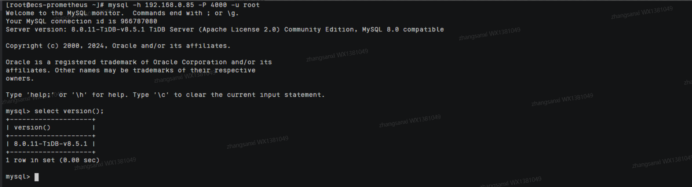
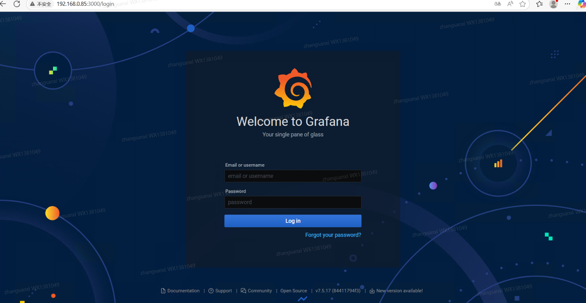
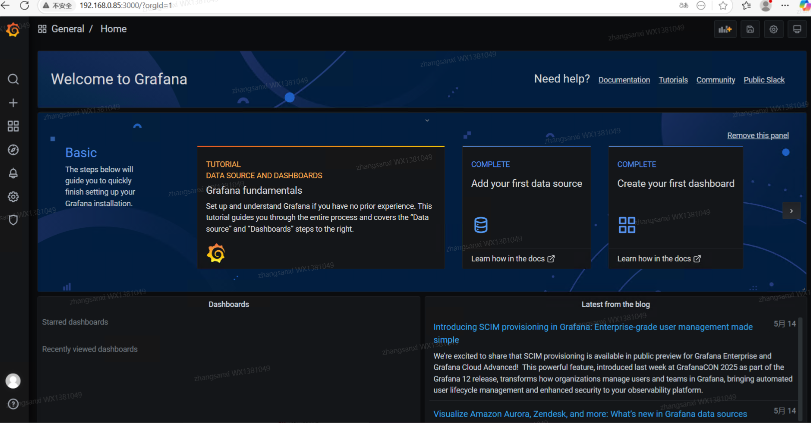
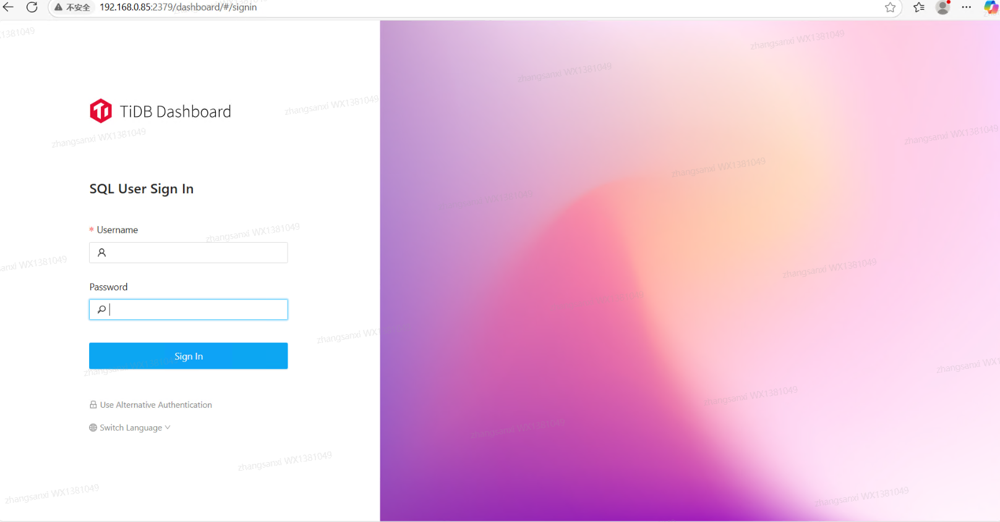
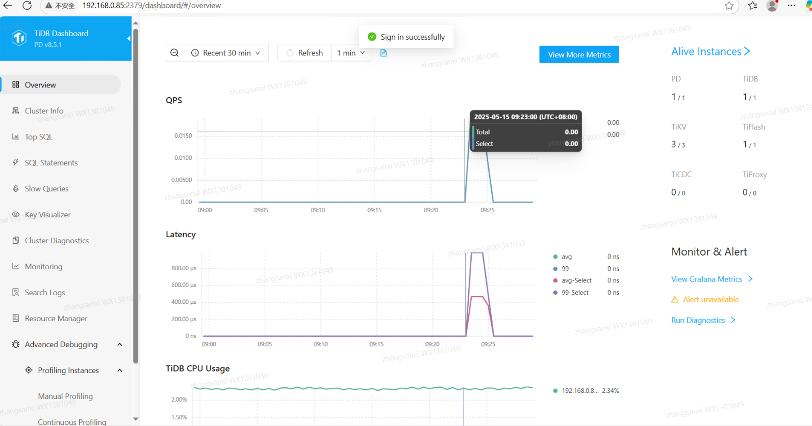

# TiDB 使用指南

# 商品链接

[TiDB-分布式NewSQL数据库](https://marketplace.huaweicloud.com/intl/hidden/contents/5fd701f5-4063-4045-a2c5-e6e5b15a2c25)

# 商品说明

‌TiDB 是一款开源的 分布式 NewSQL 数据库，由 PingCAP 公司开发，并成为 CNCF（Cloud Native Computing Foundation） 的毕业项目（与 Kubernetes、Prometheus 同级）。它结合了 传统关系型数据库（如 MySQL）的易用性 和 NoSQL 数据库的可扩展性，适用于 高并发、海量数据的在线事务处理（OLTP）和在线分析处理（OLAP） 场景。

本商品通过 鲲鹏服务器 + Huawei Cloud EulerOS 2.0 64bit 进行安装部署。

# 商品购买

您可以在云商店搜索 **tidb**。

其中，地域、规格、推荐配置使用默认，购买方式根据您的需求选择按需/按月/按年，短期使用推荐按需，长期使用推荐按月/按年，确认配置后点击“立即购买”。

# 商品资源配置

商品支持 **ECS 控制台配置**，下面对资源配置的方式进行介绍。

## ECS 控制台配置

### 准备工作

在使用ECS控制台配置前，需要您提前配置好 **安全组规则**。

> **安全组规则的配置如下：**
> - 入方向规则放通端口 `2379`、`3000`、`4000`，**源地址内必须包含您的客户端 ip**，否则无法访问
> - 入方向规则放通 CloudShell 连接实例使用的端口 `22`，以便在控制台登录调试
> - 出方向规则一键放通

### 创建ECS

前提工作准备好后，选择 ECS 控制台配置跳转到购买 ECS 页面，ECS 资源的配置如下图所示：

> **值得注意的是：**
> - VPC 您可以自行创建
> - 安全组选择 [**准备工作**](#准备工作) 中配置的安全组；
> - 弹性公网IP选择现在购买，推荐选择“按流量计费”，带宽大小可设置为5Mbit/s；
> - 高级配置需要在高级选项支持注入自定义数据，所以登录凭证不能选择“密码”，选择创建后设置；
> - 其余默认或按规则填写即可。

# 商品使用

## TiDB 使用

### 使用mysql客户端连接

mysql -h $ip -P 4000 -u root

### 访问Grafana监控

http://$ip:3000 (用户名/密码: admin/admin)

### 访问TiDB Dashboard

http://$ip:2379/dashboard (用户名: root, 密码为空)

### 参考文档

[TiDB官网](https://docs.pingcap.com/)